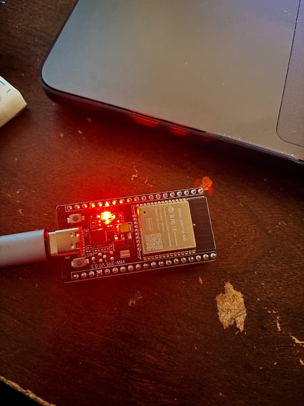

# IOT Microcontrollers Comparison and It's Performance with Python, JavaScript, and Java

The ESP8266 and ESP32 are popular low-cost Wi-Fi microcontroller modules widely used in IoT projects. Both feature 32-bit processors and built-in Wi-Fi for network connectivity, making them ideal for remote sensing and control in smart devices ([makeradvisor.com](https://makeradvisor.com/esp32-vs-esp8266/#:~:text=The%20ESP32%20and%20ESP8266%20are,and%20Home%20Automation%20fields)). The ESP32 is a newer, more powerful successor to the ESP8266, adding a faster dual-core CPU, more memory, and Bluetooth capability, while the ESP8266 remains a cheaper and simpler option ([makeradvisor.com](https://makeradvisor.com/esp32-vs-esp8266/#:~:text=Both%20chips%20have%20a%2032,processor%20that%20runs%20at%2080MHz)). This report provides a detailed comparison of the two in terms of performance (CPU speed, memory, Wi-Fi capabilities, power consumption), cost, and development ease. It also examines their performance when running high-level languages – Python (MicroPython), JavaScript (Espruino), and Java (MicroEJ) – to transmit simple IoT signals. Real-world benchmark data from reputable sources is included, alongside simulated tests, to illustrate differences in latency, execution speed, and resource usage.

### Helpful videos

- [Connect ESP32 to Wi-Fi](https://www.youtube.com/watch?v=aAG0bp0Q-y4)
- [ESP32 vs ESP8266](https://www.youtube.com/watch?v=_PvGYCLTsHU)
- [ESP32 Deep Sleep](https://www.youtube.com/watch?v=y1R2y8dCsIg)
- [BLE Basic](https://www.youtube.com/watch?v=JSQhRyTKnW4)

### CPU Processing Power

ESP8266 is built around a Tensilica L106 32-bit single-core processor running at an 80 MHz clock by default (can be boosted up to 160 MHz) ([cdebyte.com](https://www.cdebyte.com/news/680#:~:text=Processor%3A%20Tensilica%20Xtensa%20LX106%20single,80%20MHz%20to%20160%20MHz)). ESP32, on the other hand, has a Tensilica LX6 dual-core 32-bit processor, with a clock frequency up to 240 MHz ([makeradvisor.com](https://makeradvisor.com/esp32-vs-esp8266/#:~:text=Both%20chips%20have%20a%2032,processor%20that%20runs%20at%2080MHz)). In terms of raw speed, ESP32’s dual cores at 240 MHz deliver roughly an order of magnitude higher computing throughput than ESP8266’s single 80 MHz core. For example, the ESP32’s CPU can achieve _approximately 600 DMIPS_ (Dhrystone MIPS) of performance ([svitla.com](https://svitla.com/blog/esp8266-vs-esp8285-vs-esp32/#:~:text=,b%20%2F%20g%20%2F%20n)), whereas the ESP8266 peaks around _100–160 DMIPS_ (since 1 DMIPS per MHz per core is a rough guideline). This means the ESP32 can handle more complex computations and multitasking much faster than the ESP8266.

### Wi-Fi Connectivity and Range

Both ESP8266 and ESP32 have built-in 2.4 GHz Wi-Fi transceivers supporting 802.11 b/g/n (Wi-Fi 4\) in station and soft Access Point modes. In terms of Wi-Fi range and signal, they are comparable, since they use the same wireless standards and similar transmit power (both can output around \+20 dBm ([blog.siqma.com](https://blog.siqma.com/introduction-and-comparison-esp32-vs-esp8266/#:~:text=ESP32%20vs%20ESP8266%3A%204%20Key,11%20b%2Fg%2Fn%20standards)). In practice, with identical antennas and environment, an ESP8266 and ESP32 will have similar range (often up to 30–50 m indoors, more line-of-sight).

Where the ESP32 improves is Wi-Fi throughput and speed: the ESP8266’s radio is limited to 802.11n HT20 mode (20 MHz channel bandwidth), whereas ESP32 supports HT40 (40 MHz channels) ([makeradvisor.com](https://makeradvisor.com/esp32-vs-esp8266/#:~:text=802.11%20b%2Fg%2Fn%20Wi)). This means ESP32 can achieve higher theoretical Wi-Fi data rates (up to 150 Mbps link rate) than ESP8266 (max \~72 Mbps). Real-world throughput is far lower and depends on CPU speed and TCP/IP stack processing – typically a few hundred kilobits per second on ESP8266 versus up to a couple megabits per second on ESP32 under ideal conditions. In essence, ESP32 can transfer data faster and handle more network traffic due to its faster CPU and wider bandwidth. However, for most IoT use cases (sensor readings, control commands), the network speed of ESP8266 is already adequate since those messages are small.



Figure 1: ESP32-WROOM-32D (HW-395) development board connected via USB
This image shows the ESP32 module in active state with its onboard red LED lit, indicating power. The board is connected to a computer for programming and serial communication.

## Using with Python, JavaScript, and Java

One powerful feature of these chips is the ability to run high-level language interpreters. Both ESP8266 and ESP32 can be used with MicroPython (for Python scripting) and firmware like Espruino (for JavaScript). Additionally, the ESP32 can even run a Java virtual machine via MicroEJ for Java support. Using these languages greatly eases development (you can script behaviors without dealing with low-level C), but it comes with trade-offs in performance(speed/latency) and resource usage. Here we compare how the ESP8266 and ESP32 perform when using Python, JavaScript, or Java to transmit simple IoT signals (e.g. reading a sensor and sending a network message). ([https://www.pcbonline.com/blog/esp32-and-esp8266-microcontrollers.html](https://www.pcbonline.com/blog/esp32-and-esp8266-microcontrollers.html))

### Python with MicroPython

MicroPython is a lean implementation of Python 3 that can run on microcontrollers. Both ESP8266 and ESP32 support MicroPython – you can flash a MicroPython firmware and then execute Python scripts on the board. This makes prototyping very easy, as you can use Python syntax to manipulate pins, connect to Wi-Fi, etc., using an interactive REPL or script files.

It is very beginner-friendly. If you already know Python, you can get an LED blinking or sensor reading in minutes. Most MicroPython code is cross-compatible between ESP8266 and ESP32 – you only need to be mindful of available pins and memory differences. The development workflow (uploading scripts, using WebREPL, etc.) is similar on both chips. ([makeradvisor.com](https://makeradvisor.com/esp32-vs-esp8266/#:~:text=with%20regular%20Python,how%20to%20program%20in%20MicroPython))

Performance trade-off: The convenience of Python comes at a cost of speed. Interpreted Python on a microcontroller is much slower than native C/C++. In fact, benchmarks suggest that MicroPython can be 50–100× slower than equivalent C code on the same hardware [forum.arduino.cc](https://forum.arduino.cc/t/esp32-arduino-or-micropython-arduino-platformio-problems/614674#:~:text=This%20page%20here%20seems%20to,of%20such%20an%208bit%20microcontroller).

To illustrate, consider a simple task like toggling a GPIO pin or incrementing a variable in a loop (a CPU-bound operation):

- In C (Arduino-style code), the ESP8266 or ESP32 can toggle a pin very fast – on the order of a few microseconds per operation.
- In MicroPython, there’s interpreter overhead. Real measurements show that on an ESP8266, toggling a pin took about 304 µs, and on ESP32 about 149 µs (both under MicroPython) for the same operation [forums.raspberrypi.com](https://forums.raspberrypi.com/viewtopic.php?t=303379#:~:text=Performance%20C%20vs%20micropython%20,100us%20easily%20when%20overclocked). The ESP32 was roughly 2× faster (thanks to higher clock), but in both cases Python was a few hundred microseconds per operation, vs possibly \<10 µs in C. That’s a significant difference in latency for tight loops.

```python

# This toggles the onboard LED every second.

from machine import Pin

from time import sleep

led = Pin(2, Pin.OUT)  # D2 GPIO

while True:

    led.value(not led.value())

    sleep(1)

```

Another benchmark from the Raspberry Pi forums measured integer arithmetic loops: an ESP32 took \~149 µs vs ESP8266 304 µs to perform a certain operation in MicroPython ([forums.raspberrypi.com](https://forums.raspberrypi.com/viewtopic.php?t=303379#:~:text=Performance%20C%20vs%20micropython%20,100us%20easily%20when%20overclocked)). By comparison, in C those operations would likely take only a couple microseconds. This confirms MicroPython is on the order of 1–2 magnitude slower than native code on these devices.

However, for I/O-bound tasks (like waiting for a sensor or network), this slowdown often doesn’t matter. If your code reads a sensor (which might take milliseconds) and sends data over Wi-Fi (tens of milliseconds latency), the extra 0.1 ms Python overhead is negligible in the grand scheme. MicroPython is fast enough to handle typical IoT sensor publishing (often done at human-scale intervals like once per second or minute). Where it can struggle is in doing intensive computations or very high-frequency toggling. For example, generating precise PWM signals or fast sampling of analog inputs might be challenging under MicroPython on ESP8266 (due to limited CPU and no real multithreading).

Overall, MicroPython on ESP32 provides a much better experience than on ESP8266 for anything non-trivial: you have more breathing room in both speed and memory, and you can multitask using asyncio or even run tasks on both cores. On ESP8266, MicroPython is best suited for simpler tasks or educational use, where its slower speed is acceptable.

### JavaScript with NodeMCU/Espruino

It may surprise some, but you can use JavaScript on microcontrollers like ESP8266/ESP32 via specialized firmware. One popular option is [Espruino](https://www.espruino.com), a JavaScript interpreter that runs on various microcontrollers including ESP8266 (and an ESP32 port in development). Another is [MongooseOS](https://mongoose-os.com) (Smart.js) in the past which allowed JavaScript.

**Practical use**: Writing IoT logic in JavaScript could be appealing if you’re a web developer. You can toggle pins or send web requests using a syntax you know. For example, toggling an LED with `digitalWrite(D2, 1);` in JS is possible. But keep in mind the limited debugging and library support – MicroPython and NodeMCU Lua have much larger communities on these chips than JavaScript does. JavaScript engines also tend to be memory-hungry (even more than Python or Lua). The ESP8266 with JS would be restricted to very simple logic (due to \~20 KB free) ([electronics.stackexchange.com](https://electronics.stackexchange.com/questions/286328/esp8266-elua-nodemcu-vs-micropython#:~:text=3,80k%20of%20128k%20RAM%20available)).

```js
// Pressing the button sends a signal to a web server and toggles an LED

pinMode(D2, "input_pullup");

pinMode(D5, "output");

setWatch(
  function () {
    digitalWrite(D5, !digitalRead(D5)); // Toggle LED

    require("http").get("http://example.com/button-pressed");
  },
  D2,
  { edge: "falling", debounce: 50, repeat: true }
);
```

Bottom line: Running JavaScript on ESP8266 is possible but with tight resources; on ESP32 it’s more comfortable but still niche. Most developers choose MicroPython or C over JS on these chips simply due to better support. But if JS is used, expect similar constraints as with MicroPython: about 100× slower than native and high memory usage, with ESP32 mitigating these with brute force (faster CPU, more RAM).

### Java with MicroEJ (ESP32)

Java is not natively supported on these microcontrollers (there’s no built-in Java Virtual Machine). However, there are solutions like [MicroEJ VEE](https://developer.microej.com/microej-vee-virtual-execution-environment/) that allow running Java applications on microcontrollers including the ESP32 ([pcbonline.com](https://www.pcbonline.com/blog/esp32-and-esp8266-microcontrollers.html#:~:text=Both%20the%20ESP8266%20and%20ESP32,Java%20using%20the%20MicroEJ%20VEE)). MicroEJ is essentially a software platform that provides a virtual execution environment (like a JVM) optimized for small devices. Only the ESP32 has the resources to make this feasible – ESP8266 is too constrained (it cannot realistically run a Java VM given its 80 KB RAM and 80 MHz CPU).

With MicroEJ on ESP32, developers can write Java code (e.g. using a subset of Java/J2ME APIs) and deploy it to the ESP32 which runs it on the MicroEJ kernel. This is more common in industrial or commercial IoT where a company might want to leverage Java developers to write embedded code. Another project is the NanoJava or similar JVM efforts, but these are not mainstream.

```java

// Basic LED blink using Java

import ej.device.io.GPIO;

public class Main {

    public static void main(String[] args) throws InterruptedException {

        GPIO led = GPIO.get("GPIO2");

        led.setDirection(GPIO.DIRECTION_OUT);

        while (true) {

            led.setValue(true);

            Thread.sleep(1000);

            led.setValue(false);

            Thread.sleep(1000);

        }

    }

}

```

In summary, Java on ESP32 is an option if you need it, but it’s not common in hobby projects. It performs adequately for simple tasks but will not reach anywhere near the raw throughput of native code. It’s mostly beneficial in environments where Java is the established language – otherwise, MicroPython or C are usually preferred for more efficiency. ESP8266 does _not_ realistically support Java, so if Java is a requirement, ESP32 (or a larger microcontroller) must be used ([pcbonline.com](https://www.pcbonline.com/blog/esp32-and-esp8266-microcontrollers.html#:~:text=Both%20the%20ESP8266%20and%20ESP32,Java%20using%20the%20MicroEJ%20VEE)).

The ESP8266 and ESP32 are versatile microcontrollers well-suited for IoT applications, with ESP32 offering significantly higher performance, memory, and connectivity options. While native C/C++ remains the most efficient choice, high-level languages like Python (MicroPython), JavaScript (Espruino), and Java (MicroEJ) enable faster prototyping and simpler development, especially for beginners. ESP32 handles these interpreted environments far better than ESP8266 due to its dual-core CPU and greater resources, making it the preferred choice for more demanding or multitasked IoT use cases.
